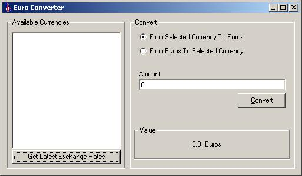



## Euro Converter \- Real Time Exchange Rates\!

### Description

This is a follow up to the code posted yesterday about a Euro converter. The problem with all converters I have seen on here is that the exchange rate is hard coded in to the program. This one is different however. It grabs the latest exchange rates from a web site and uses them! Very simple app, but could be made to convert between any currency and another very easily. VOTE UK INDEPENDENCE PARTY! :o)
 
### More Info
 

             |
---                |---
**Submitted On**   |2001-11-23 09:17:46
**By**             |[Wamdue Project](https://github.com/Planet-Source-Code/PSCIndex/blob/master/ByAuthor/wamdue-project.md)
**Level**          |Intermediate
**User Rating**    |5.0 (10 globes from 2 users)
**Compatibility**  |VB 6\.0
**Category**       |[Complete Applications](https://github.com/Planet-Source-Code/PSCIndex/blob/master/ByCategory/complete-applications__1-27.md)
**World**          |[Visual Basic](https://github.com/Planet-Source-Code/PSCIndex/blob/master/ByWorld/visual-basic.md)
**Archive File**   |[Euro\_Conve3688111232001\.zip](https://github.com/Planet-Source-Code/wamdue-project-euro-converter-real-time-exchange-rates__1-29125/archive/master.zip)

